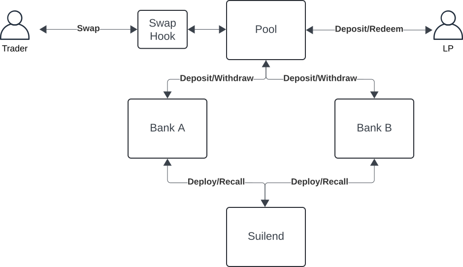
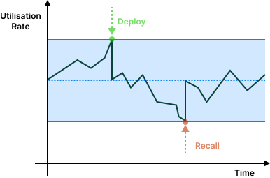
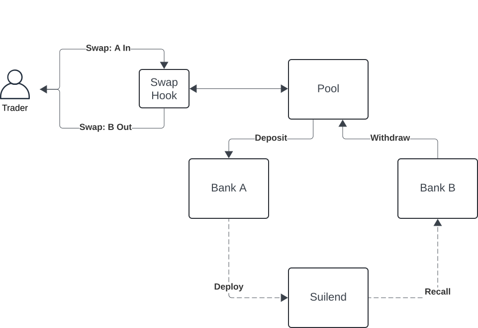
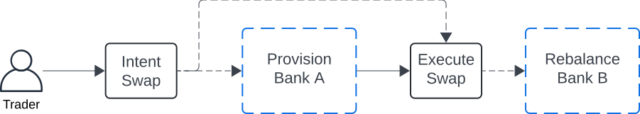
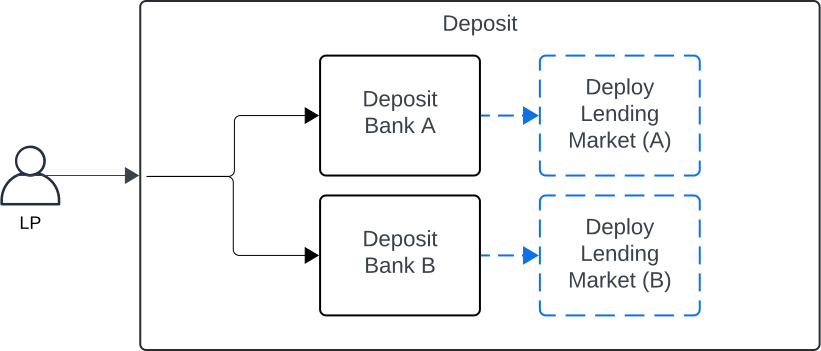
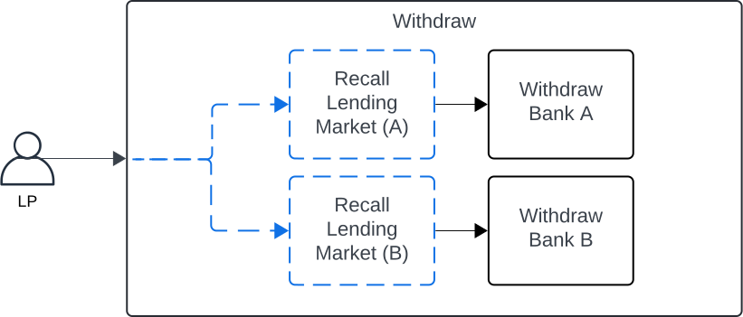

# Suilend AMM

## Introduction

Suilend AMM is a hooks-based Automated Market Marker protocol specialised in liquidity reutilisation and extensibility of quotation systems.

- Hook-based AMM which allows to plug-in different types of swap quotation systems (hooks) on top of the base implementation;
- The protocol has a shared liquidity utilisation model, in which AMM pools deposit and withdraw their liquidity in banks, and banks in turn are responsible for deploying and recalling liquidity to Suilend (which is a lending market);

## Hooks Model
By introducing hooks, the protocol allows for the plugin of multiple quotation systems, as well as innovative features surrounding liquidity management. Currently the protocol has three quotation built-in: a Constant-Product AMM; a Fixed-Range Constant Sum AMM; and an Oracle AMM with dynamic fees based on volatility.

To initiate a pool, the base pool module provides a generator function to be used by the hook modules, in otder to construct the pool. This function allows the hook to plug-in its custom state.

Similarly, the base module makes the core swap function available to the hooks, the hooks themselves are then responsible for re-exporting the swap functionality to the client. This way, hooks can apply logic before and after the base logic of the pool is executed.

## Liquidity Reutilisation Model
One core feature of the protocol is the liquidity reutilisation. In traditional AMM designs, liquidity is locked in the pool and it remains idle until used to fulfil a swap. Even throughout trading activity only a portion of the liquidity gets utilised, whereas the majority of liquidity sits idle in contigency.

Suilend's AMM works by pulling liquidity from AMMs together into a Bank, which is then deployed to Suilend' lending markets. This reduces LP's opportunity costs by allowing them earn an extra yield on the liquidity provided.

Banks work by pulling liquidity from a given coin type and allocate a portion of that liquidity to the lending markets, thus earning some yield. By pulling liquidity together, AMM pools are able to fulfil their swap commitments by tapping into global net liquidity available in the respective banks, thus limiting the amount of times liquidity has to be recalled from the lending markets.

As an ilustration, if one AMM pool has high demand for SUI (i.e. high volume of swaps that extract SUI from the pool), and another has high supply of SUI (i.e. high volume of swaps that add SUI to the pool), to a great degree these flows willl offset each other.

In other words, in periods of low market correlations, offsetting flows take place, whereas in periods of high market correlations there's a higher necessity in recalling liquidity from lending markets.

### Utilisation Target and Buffer
Banks are setup with a target utilisation rate. Liquidity deployed to lending market is allowed to fluctuate around the target utilisation rate and the extent to which these fluctuations can deviate form the target is kept by a utilisation buffer. So if the target utilisation is set at 50% with a utilisation buffer of 5%, then utilised liquidity is allowed to fluctuate between 45% and 55%.

These parameter are set by the global admin when lending is initialised, however these can be technically updated dynamically, leaving the door open to strategies that manage utilisation based on market conditions such as volatility and order flow.

Utilisation rate $U$ is defined as rate between deployed liquidity $d$ and total liquidity $L$ (deployed plus available liquidity $a$):

$$
U = \frac{d}{L}
$$

where $L = d + a$

When a given inflow or outflow $\Delta L$ takes place, we recompute the post utilisation rate, such that for negative flows we recall funds from the lending market if the following condition is met:

$$
\begin{gather*}
    U < U^* - b \\
    \iff \frac{d}{a + d - \Delta L} < U^* - b \\
    \iff d < (U^* - b)(a + d - \Delta L) \; : \; \Delta L < a + d
\end{gather*}
$$

Where $b$ stands for the utilisation buffer.

The recall amount $\Delta a$ is then computed as follows:

$$
\begin{gather*}
    \frac{d - \Delta a}{a + d - \Delta L} = U^* \\
    \iff \Delta a = d - U^*(a + d - \Delta L)
    
\end{gather*}
$$

In the same fashion, when flows are positive we deploy funds to the lending market if the following condition is met:

$$
\begin{gather*}
    U > U^* + b \\
    \iff \frac{d}{a + d + \Delta L} > U^* + b \\
    \iff d > (U^* + b)(a + d + \Delta L)
\end{gather*}
$$

Where the deploy amount $\Delta d$ is computed as follows:

$$
\begin{gather*}
    \frac{d + \Delta d}{a + d + \Delta L} = U^* \\
    \iff \Delta d = U^*(a + d + \Delta L) - d
\end{gather*}
$$

### Swap model

Given that a swap is constituted by an inflow and a corresponding outflow, a provisioning action takes place before the swap is executed, in order to guarantee that the pool has access to a sufficient amount of funds it needs to fulfil the outflow, as well as a posterior action which rebalances the liquidity coming in from the inflow.

The swap model follows an intent/execute patern where traders start by formalising an intent to swap with a given pool. During the intent process the pool formulates a quote. The intent object itself is a wrapper around a quote, which its creation signals to the pool that a swap is about to take please.

The core reason behind breaking the swap into this pattern is to allow the banks provision enough liquidity to fulfil the swap. The flow is as follows:

1. Intent swap: Pool provides a quotation via `hook_xyz::intent_swap`
2. Based on the intent object, banks provision liquidity as needed
3. Swap is executed `hook_xyz::execute_swap`
4. Optionally rebalance the utilisation of the bank receiving the inflow

### Liquidity Providers

Pertaining to the deposit and withdraw of liquidity by the LPs, the flow is rather straigthforward.

When depositing liquidity, the respective banks will optionally deploy extra liquidity to the lending markets to guarantee that utilisation bounds are met.

Conversely, when redeeming liquidity, we check if the outflows can be met and if the banks utilisation remains within the bounds defined, and if not the banks will recall the required liquidity from the lending markets.

## Hooks

### Constant Product Offset AMM
The constant-product AMM hook uses the default constant-product function with an horizontal and vertical offset. This hook operates on the principle of preserving the product of the reserves of the two assets in the pool, ensuring that the product remains constant regardless of the trades that occur.

We defined the constant-product formula is defined as:

$$
(x+x_O)(y+y_O)=k
$$

Where:
- $x$ represents the reserve of asset 𝑋
- $x_O$ represents an horizontal offset
- $y$ represents the reserve of asset 𝑌
- $y_O$ represents an vertical offset
- $k$ is the invariant product of the reserves

When a trader swaps one asset for another, the constant-product formula is adjusted to reflect the new reserves while maintaining the invariant $k$.

Given a swap, the AMM adjusts the reserves to maintain the invariant. 

Given a input $\Delta x$, the pool will return an output $\Delta y$ such that:

$$y - \Delta y + y_O = \frac{k}{x + \Delta x + x_O}$$

Hence:

$$\Delta y = (y + y_O) - \frac{k}{x + x_O + \Delta x}$$

Fees are then computed on the output amount $\Delta y$:

$$\text{Fee} = \Delta y \times Fee Rate$$

#### Constant-Product Offsets

We introduce both an horizontal and vertical offset, which allows pool creaters to initialize a pool with one-sided liquidity. By setting the offset as a non-zero value we're shifting the constant-product curve horizontally, in the case of $x_O$, or vertically, in the case of $y_O$.

For an horizontal offset, we can therefore define the point at which the curve intercepts the y axis (when $x=0$) as follows:

$$
\begin{gather*}
    (x+x_O)(y-0) = k \\
    \iff (0+x_O)(y-0) = k \\
    \iff x_0 \times y = k \\
    \iff y = k / x_0 \\
\end{gather*}
$$

In the same logic, for a vertical offset, the point at which the curve intercepts the x axis is:

$$
x = k / y_0
$$

### Fixed Range Constant-Sum AMM
TODO

### Oracle AMM
The oracle AMM hook provides a quotation mechanism with dynamic fees based on market volatility. When a trader swaps, the hook computes an exponential-moving average of the volatility based on a reference price and accumulated volatility metric.

We use absolute price deviations as a proxy for volatility. We define the accumulated volatility metric as follows:

$$
V_{\lambda} = \max\left(
    \hat{V} + \max(|P_{oracle} - \hat{P}|, |P_{internal} - \hat{P}|),
    \text{MaxVol}
\right)
$$

Where $P_{oracle}$ stands for the oracle price and $P_{internal}$ the internal constant-product price of the pool. The volatility accumulated metric is capped by a parameter $MaxVol$ defined by the pool.

When a swap occurs, at $n+1$, we compute the reference price as well as the reference volatility:

$$
\hat{P}_{n+1} = 
\begin{cases} 
P_{oracle} & \text{, } t = 0 \\
\hat{P}_n & \text{, } \Delta t < f \\
P_{oracle} & \text{, } \Delta t \geq f
\end{cases}
$$

$$
\hat{V}_{n+1} = 
\begin{cases}
0 & \text{, } t = 0\\
\hat{V}_n & \text{, } \Delta t < f \\
V_{\lambda} \times R & \text{, } \Delta t \geq f \\
0 & \text{, } \Delta t > d
\end{cases}
$$

where
$$
\Delta t = \hat{t}_{n} - t
$$

and we update the reference time after the two previous computations such that:

$$
\hat{t}_{n+1} = 
\begin{cases}
t & \text{, } t = 0\\
\hat{t}_{n} & \text{, } \Delta t < f \\
t & \text{, } \Delta t \geq f \\
\end{cases}
$$

The hook then provides a quotation price bsaed on the constant-product formula and adds a dynamic fee charged on the output:

$$
\Delta Out \times \frac{V_{\lambda}^2 \times \phi}{100}
$$

Where $\Delta Out$ represents the output amount and $\phi$ is a fee control parameter used for scaling.

### Risks and mitigations
TODO