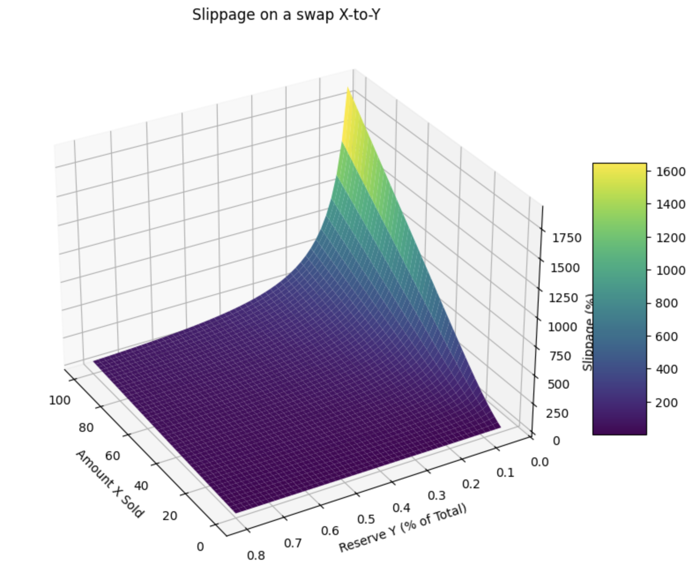
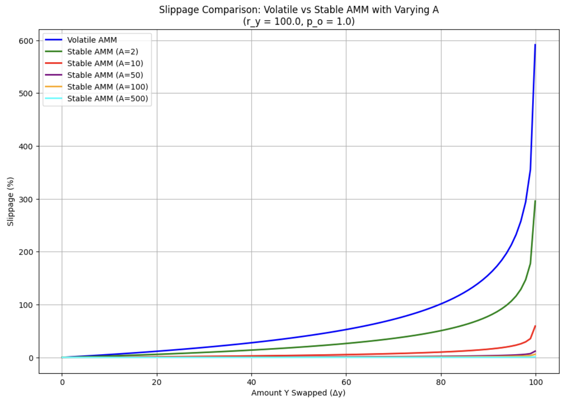

# Dynamic Liquidity Fee

The idea behind the dynamic liquidity fee is to model the slippage of a given trade based on how much liquidity is extracted from it corresponding output token.

In a naive implementation of an oracle-based AMM, liquidity pools provide the oracle price as the trade execution price. However, prices given by oracles do not reflected the current execution price of a trade of size $M$, rather they represend the current last price. Therefore, naive implementations suffer impermanent loss as they rely solely on the oracle price, which is a lagging indicator. Furthermore, naive implementations do not have a self-balancing mechanism and are therefore susceptible to the risk of one side of the pool being fully drainned.

We introduce a dynamic liquidity fee which solves for these two issues. This fee effectively applies a price change to trades and therefore simulates how trades would slide through a conventional orderbook. As in limit orderbooks, small trades will consume a small percentage of the available liquidity and will therefore incur in a small price change. Conversely, larger trades will incur in a higher price change as they consume a larger portion of the available liquidity.

We take the oracle price as the current midmarket price, and apply a liquidity fee based on how large a trade is as a percentage of the liquidity drained from the output reserve.

## Intuition

We start with the following relationship for calculating the output amount in a token swap is:

$$
\Delta Output = R_{Output}(1 - e^{-U})
$$

where $u$ is the **utilization metric**.

- **$R_{Output}$**: Represents the total reserve of the output token in the liquidity pool. It’s the maximum amount you could theoretically get if you drained the entire pool.

- **$u$ is the utilization metric**: This measures how much of the pool’s liquidity a trade consumes. It reflects the trade size relative to the pool’s reserves, adjusted by factors like price. A small $u$ indicates a small trade that barely taps the pool, while a large one signals a large trade that strains liquidity.

- **$e^{-U}$**: The exponential function translates the utilization metric into a slippage factor:
  - For small trades (small $u$), $e^{-U}$ is close to 1, so $1 - e^{-U} \approx 0$. You get a small output, proportional to the trade size, with minimal slippage relative to the market price.
  - For large trades (large $u$), $e^{-U}$ approaches 0, so $1 - e^{-U} \approx 1$. You receive a larger fraction of the pool’s reserve, but slippage increases, limiting the output to prevent draining the pool.

- **$(1 - e^{-U})$**: This acts as a "scaling factor" applied to the reserve. It determines what fraction of the pool’s liquidity you receive:
  - Small trades yield a small fraction of the reserve, closely aligned with the expected market price.
  - Large trades yield a larger fraction but face higher slippage, capping the output to maintain pool stability.

- **$Delta_{Output}$**: The final output is the pool’s reserve ($R_{Output}$) scaled by this slippage factor. This ensures:
  - Small trades execute close to the market price with little penalty.
  - Large trades encounter increasing slippage, protecting the pool from excessive depletion and mimicking the price dynamics of a traditional orderbook.

## Liquidity Fee for Volatile Pairs

We start by defining the variables:

- Reserve X: $R_x$
- Reserve Y: $R_y$
- Oracle Midprice: $P$
- Oracle Price of X: $P_x$
- Oracle Price of Y: $P_y$
- Decimals X: $d_x$
- Decimals Y: $d_y$

Depending on the direction of a trade, the utilization is computed differently to account for which token is the base and quote in the oracle price, as well as to account which pool reserve corresponds to the output reserve.

In loose terms we define the utilization $u$ as 
$$
\frac{\tilde{\Delta}_{out}}{R_{out}}
$$

where,

$$
\tilde{\Delta}_{out}
$$

corresponds to the output amount as provided by the oracle price.

To understand how this equation is then adjusted to both trade direction we have to look at the oracle price.

The oracle mid-price is defined as follows:

$$P = P_x / P_y$$

Both price fees $P_x$ and $P_y$ are defined in terms of USD as its Quote currency. If we consider that $P_x = \frac{USD_{units}}{X_{units}}$, and same goes for $P_y$, then:

$$
P = P_x / P_y \Leftarrow \frac{ \frac{USD_{units}}{X_{units}} }{ \frac{USD_{units}}{Y_{units}} } \\\\
\Leftarrow \frac{Y_{units}}{X_{units}}
$$

Therefore giving us the standard quotation price:

$$
\frac{Y_{units}}{X_{units}} = \frac{QUOTE}{BASE}
$$

Therefore, to convert a $\Delta_x$ to $\Delta_y$ we multiply by the price:

$$
\Delta_x \cdot P = \Delta_x \cdot \frac{Y_{units}}{X_{units}} = \tilde{\Delta}_{y}
$$

And vice-versa the other way around:

$$
\frac{\Delta_y}{P} = \Delta_y \cdot \frac{X_{units}}{Y_{units}} = \tilde{\Delta}_{x}
$$

However, we do have to consider that both token reserves have different decimals, so we adjust accordingly:

$$
\Delta_x \cdot P = \Delta_x \cdot \frac{Y_{units}}{X_{units}} \cdot \frac{10^{d_y}}{10^{d_x}} = \tilde{\Delta}_{y}
$$

$$
\frac{\Delta_y}{P} = \Delta_y \cdot \frac{X_{units}}{Y_{units}} \cdot \frac{10^{d_x}}{10^{d_y}} = \tilde{\Delta}_{x}
$$

We therefore arrive to the following functions:

### Swap X to Y:
$$
\Delta y = R_y (1 - e^{-U_y})= R_y (1 - e^{-\frac{P \Delta x}{R_y 10^{d_x - d_y}}})
$$

### Swap Y to X:
$$
\Delta x = R_x (1 - e^{-U_x}) = R_x (1 - e^{-\frac{\Delta y 10^{d_x - d_y} }{R_x P}})
$$

These functions result in the following exponential relationship between trade size and slippage, as illustrated in the plot below.

## Stable Swap Flavor
(For the purpose of this segment we will treat $\Delta y$ as the output)

In the previous chapter we degined a slippage model that is adequate for volatile tokens. In this chapter we will adapt the model to stable pairs.

For the stable swap version, we want:

Flat Slippage for Small Trades: Near-zero slippage when $Δy$ is small relative to $R_y$, mimicking stable asset pairs (e.g., USDC/USDT).

Exponential Growth Later: Slippage increases sharply as $Δy$ grows beyond a threshold, retaining the more aggressive slippage for large trades.

We introduce an amplification parameter $A$ to control flatness:

- For small trades, the effective price stays close to $P$.
- For large trades, it transitions to the original exponential behavior.

### Modified Pricing Function

We define a new marginal price that flattens initially:

- Original marginal price:
$$p_m(y) = \frac{1}{P} \cdot \frac{1}{1 - \frac{y}{R_y}}$$
- Stable version: We add a term to reduce sensitivity for small $y$, transitioning to the original form later:

$$p_m(y) = \frac{1}{P} \cdot \left(1 + \frac{\frac{y}{R_y}}{A \left(1 - \frac{y}{R_y}\right)}\right)$$

- $A$: Amplification factor (large $A$ flattens slippage, small $A$ approaches the volatile model).
- $\frac{y}{R_y}$: Fraction of Y swapped.
- $1 - \frac{y}{R_y}$: Remaining Y reserve fraction.

### Total Trade Input:

The total input $\Delta x$ is therefore defined by the integral from zero consumed liquidity to $\Delta y$:

$$\Delta x = \int_{0}^{\Delta y} \frac{1}{P} \cdot \left(1 + \frac{\frac{y}{R_y}}{A \left(1 - \frac{y}{R_y}\right)}\right) \, dy$$

We proceed to solve the integral:

Let $z = \frac{y}{R_y}$, so $dy = R_y \, dz$, and limits from $y = 0$ to $\Delta y$, or $z = 0$ to $\frac{\Delta y}{R_y}$:

$$
\Delta x = \frac{R_y}{P} \int_{0}^{\frac{\Delta y}{R_y}} \left(1 + \frac{z}{A(1-z)}\right) \, dz
$$

$$
= \frac{R_y}{P} \int_{0}^{\frac{\Delta y}{R_y}} \left(1 + \frac{z}{A(1-z)}\right) dz
$$

- First term: $\int 1 \, dz = z$.
- Second term: $\int \frac{z}{A(1-z)} \, dz$.

- Substitute $u = 1 - z$, $du = -dz$, $z = 1 - u$, limits from $z = 0$ to $\frac{\Delta y}{R_y}$, or $u = 1$ to $1 - \frac{\Delta y}{R_y}$:
- $\int \frac{z}{A(1-z)} \, dz = \int \frac{1-u}{A u} (-du) = -\frac{1}{A} \int \left(\frac{1}{u} - 1\right) du = -\frac{1}{A} (\ln u - u)$.
- Adjust limits: $-\frac{1}{A} [\ln u - u]_{1}^{1 - \frac{\Delta y}{R_y}} = -\frac{1}{A} \left( \ln \left(1 - \frac{\Delta y}{R_y}\right) - \left(1 - \frac{\Delta y}{R_y}\right) - (\ln 1 - 1) \right)$.

### Full solution:

we arive at the following primitive:

$$
\Delta x = \frac{R_y}{P} \left[ z - \frac{1}{A} (\ln(1-z) + z - 1) \right]_{0}^{\frac{\Delta y}{R_y}}
$$

### Evaluate:

- At $z = \frac{\Delta y}{R_y}$: $\frac{\Delta y}{R_y} - \frac{1}{A} \left( \ln \left(1 - \frac{\Delta y}{R_y}\right) + \frac{\Delta y}{R_y} - 1 \right)$.
- At $z = 0$: $0 - \frac{1}{A} (0 + 0 - 1) = \frac{1}{A}$.

$$
\Delta x = \frac{R_y}{P} \left( \frac{\Delta y}{R_y} - \frac{1}{A} \left( \ln \left(1 - \frac{\Delta y}{R_y}\right) + \frac{\Delta y}{R_y} - 1 \right) - \frac{1}{A} \right)
$$

We simplify further:

$$
\Delta x = \frac{R_y}{P} \left( \frac{\Delta y}{R_y} - \frac{1}{A} \ln \left(1 - \frac{\Delta y}{R_y}\right) - \frac{1}{A} \frac{\Delta y}{R_y} + \frac{1}{A} - \frac{1}{A} \right)
$$

$$
\Delta x = \frac{R_y}{P} \left( \frac{\Delta y}{R_y} \left( 1 - \frac{1}{A} \right) - \frac{1}{A} \ln \left(1 - \frac{\Delta y}{R_y}\right) \right)
$$

### Stable Swap Equation

$$
\Delta x = \frac{R_y}{P} \left( \left( 1 - \frac{1}{A} \right) \frac{\Delta y}{R_y} - \frac{1}{A} \ln \left(1 - \frac{\Delta y}{R_y}\right) \right)
$$

### Stable Swap Equation - X2Y

In the previous chapter we skipped the decimal adjustment for simplicity:

$$
\Delta x = \frac{10^{d_x - d_y}}{P} R_y \left( \left( 1 - \frac{1}{A} \right) \frac{\Delta y}{R_y} - \frac{1}{A} \ln \left(1 - \frac{\Delta y}{R_y}\right) \right)
$$

$$
\frac{\Delta x \cdot P}{R_y \cdot 10^{d_x - d_y}} = \left( \left( 1 - \frac{1}{A} \right) \frac{\Delta y}{R_y} - \frac{1}{A} \ln \left(1 - \frac{\Delta y}{R_y}\right) \right)
$$

let k be:
$$
k = \frac{\Delta x \cdot P}{R_y \cdot 10^{d_x - d_y}}
$$

let z be:
$$
z = \frac{\Delta y}{R_y}
$$

We then have to find the root of the equation:
$$
F(z) = \left( 1 - \frac{1}{A} \right) z - \frac{1}{A} \ln \left(1 - z\right) - k
$$

In that what is the value of $z$ such that $F(z) = 0$.

#### The inital guess 

The variable $k$ can be interpreted as the trade utilization, if the trade was executed at the oracle price. In the same fashion, we can interpret $z$ as the actual utilization of the trade, given the actual slippage computed by the pool. Therefore, we can use $k$ as the initial guess for $z$. We know that the actual utilization of the trade must be lower than the utilization given by the oracle, because that's the whole point of having slippage. We know that $z < k$, and that therefore $k$ will act as an upper bound for the value of $z$.

### The inital guess - proof

Since we know that: $z = \frac{\Delta y}{R_y}$ and we know that the upper bound for $\Delta y = \Delta x \cdot P \cdot \frac{10^{d_y}}{10^{dx}}$.

This is because of the equality holds for a swap at the oracle price:
$$
\frac{\Delta y}{\Delta x} \cdot \frac{10^{d_x}}{10^{d_y}} = \frac{Y_o}{X_o}
$$

where $P =  \frac{Y_o}{X_o}$ is the oracle price, which relates a quantity of $Y$ with a quantity of $X$.

In other words, since the swap incurs slippage, the actual delta Y must be lower than the delta Y otherwise received by the oracle price:

$$\Delta y < \Delta x \cdot P \cdot \frac{10^{d_y}}{10^{dx}}$$

Both $z$ and $\Delta Y$ are positively related. Therefore, we want to find the upper bound of $z$ such that:

$$
z_U = \frac {\Delta y_o}{R_y}
$$

$$
z_U = \frac{\Delta x \cdot P}{R_y} \cdot \frac{10^{d_y}}{10^{d_x}} = k
$$

It follows the constraint:

$$
z < k
$$

This constraint is useful as it serves as the initial guess used in the numerical approximation needed to solve the equation (since its transcendental, we cannot solve it analytically).

### Stable Swap Equation - Y2X
For y2x, the P is multiplying and the decimal adjusment dividing:

$$
\Delta y = \frac{P}{10^{d_x - d_y}} R_x \left( \left( 1 - \frac{1}{A} \right) \frac{\Delta x}{R_x} - \frac{1}{A} \ln \left(1 - \frac{\Delta x}{R_x}\right) \right)
$$

$$
\frac{\Delta y \cdot 10^{d_x - d_y}}{R_x \cdot P} = \left( \left( 1 - \frac{1}{A} \right) \frac{\Delta x}{R_x} - \frac{1}{A} \ln \left(1 - \frac{\Delta x}{R_x}\right) \right)
$$

let k be:
$$
\frac{\Delta y \cdot 10^{d_x - d_y}}{R_x \cdot P}
$$

$$
z = \frac{\Delta x}{R_x}
$$

We then have to find the root of the equation:
$$
F(x) = \left( 1 - \frac{1}{A} \right) z - \frac{1}{A} \ln \left(1 - z\right) - k
$$

In that what is the value of $z$ such that $F(z) = 0$.

#### The inital guess 

The variable $k$ can be interpreted as the trade utilization, if the trade was executed at the oracle price. In the same fashion, we can interpret $z$ as the actual utilization of the trade, given the actual slippage computed by the pool. Therefore, we can use $k$ as the initial guess for $z$. We know that the actual utilization of the trade must be lower than the utilization given by the oracle, because that's the whole point of having slippage. We know that $z < k$, and that therefore $k$ will act as an upper bound for the value of $z$.

### The inital guess - proof

Since we know that: $z = \frac{\Delta x}{R_x}$ and we know that the upper bound for $\Delta x = \frac{\Delta y}{P} \cdot \frac{10^{d_x}}{10^{dy}}$.

This is because of the equality holds for a swap at the oracle price:
$$
\frac{\Delta x}{\Delta y} \cdot \frac{10^{d_y}}{10^{d_x}} = \frac{X_o}{Y_o}
$$

where $P =  \frac{Y_o}{X_o}$ is the oracle price, which relates a quantity of $Y$ with a quantity of $X$.

In other words, since the swap incurs slippage, the actual delta Y must be lower than the delta Y otherwise received by the oracle price:

$$\Delta x < \frac{\Delta y}{P} \cdot \frac{10^{d_x}}{10^{d_y}}$$

Both $z$ and $\Delta Y$ are positively related. Therefore, we want to find the upper bound of $z$ such that:

$$
z_U = \frac {\Delta x_o}{R_x}
$$

$$
z_U = \frac{\Delta y}{R_x \cdot P} \cdot \frac{10^{d_x}}{10^{d_y}} = k
$$

It follows the constraint:

$$
z < k
$$

This constraint is useful as it serves as the initial guess used in the numerical approximation needed to solve the equation (since its transcendental, we cannot solve it analytically).

### Stable Swap visualized

The result is the following:

### Note on the impact of BToken Ratios

The btoken ratio of the output has an impact on how the pool perceives the scarcity of the output reserve, which itself is what controls the slippage.